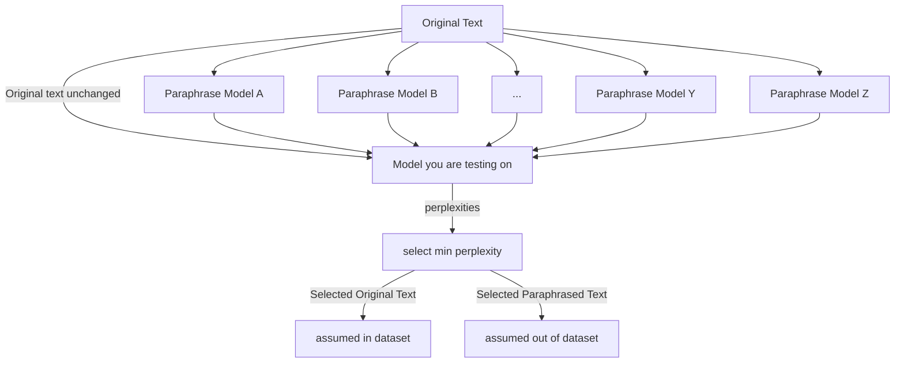

# Perplexity Benchmark

*Using the **perplexity** metric on a combination of original and paraphrased texts to detect if the original text was in the dataset.*

## The Idea
Create an offshoot of the DeCop benchmark that doesn't require instruction-tuned models, that could theoretically use an infinite amount of alternative texts, and is more transparent about how the model is guessing (you could look at perplexity scores, the model is providing the perplexity scores).

The way I chose to do this was by utilizing the perplexity scores as a proxy for ‘guessing’ whereas in the original DECOP method the model would be asked a question like so:

```
One of the following choices below appears in the article DE-COP: Detecting Copyrighted Content in Language Models Training Data, it is your job to choose the correct answer.
	[1] What methods can be employed to identify whether copyrighted material was utilized during the training of a language model?
	[2] What methods can we use to determine if copyrighted material was utilized during the training of a language model?
	[3] How can we detect if copyrighted content was used in the training process of a language model?
	[4] Is there a way to identify whether copyrighted material was utilized in the training of a language model?
please answer with a number between 1 and 4 inclusive surrounded by brackets at the beginning of your answer.

```
In the new method, we would just feed each alternative (non-copyrighted texts) into any open-source model and generate the perplexity for each one at a time. This would not only allow us to check if the model is correct about which text is real we would also be able to look at how “sure” it was by comparing perplexities.
## Pros and Cons
#### Pros:
- More easily extensible without having to worry about the model losing track of instruction
- Doesn't require the model to be instruction finetuned
- Gives more information than just what was ‘chosen’ (provides perplexity score)
- Based on initial testing the model could ‘guess’ the correct answer with a high probability at 4 options all from Claude even if it was impossible that it saw it in training but this is possible to fix using more and verified  options
- If extended past 4 options has a lower false positive rate than decop
### Cons:
- Only works on opensource models
## Visual Representation

